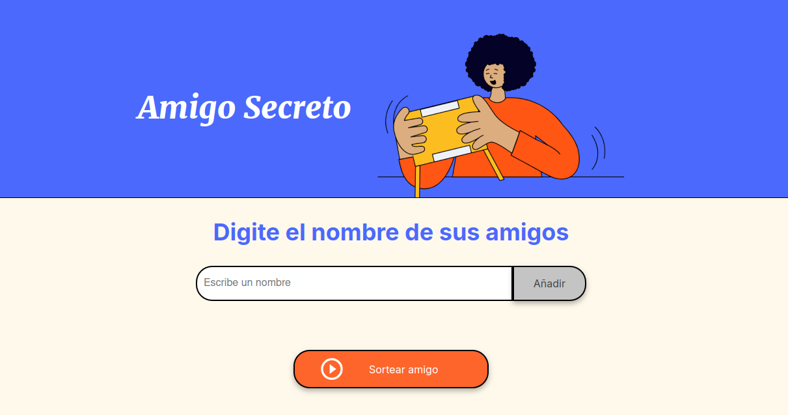

# Amigo Secreto 🎁

¡Bienvenido a la aplicación interactiva de Amigo Secreto! Esta herramienta facilita el proceso de sorteo entre amigos, familiares o compañeros de trabajo de una manera sencilla y divertida.



## 🚀 Características

- **Agregar participantes:** Permite ingresar nombres con validaciones para garantizar entradas válidas.
- **Sorteo al azar:** Selección aleatoria del ganador entre los participantes.
- **Interfaz amigable:** Diseño simple e intuitivo para mejorar la experiencia del usuario.
- **Notificaciones:** Alertas informativas para guiar al usuario durante el uso.

## 📋 Requisitos

Para ejecutar este proyecto, necesitas:
- Un navegador web moderno (Chrome, Firefox, Edge, etc.).
- No se requieren instalaciones adicionales.

## 📂 Estructura del proyecto

```plaintext
/
├── index.html       # Archivo HTML principal
├── style.css        # Estilos del proyecto
├── app.js           # Lógica de la aplicación
├── assets/          # Carpeta con imágenes e íconos
└── README.md        # Documentación del proyecto


```

## 🛠️ Instrucciones de uso

1. Descargar el proyecto

- git clone https://github.com/CrissCraxz/Amigo_Secreto.git

2. Abrir la aplicación

- Navega hasta la carpeta del proyecto.
- Abre el archivo index.html en tu navegador.

3. Agregar nombres

- Escribe un nombre en el campo de entrada y haz clic en el botón "Añadir".
- También puedes presionar la tecla Enter para agregar un nombre.
- Validaciones:
- Los nombres no pueden estar vacíos ni contener caracteres especiales.
- Solo se permiten letras y espacios.

4. Sortear un ganador

- Una vez que haya al menos 2 participantes, el botón "Sortear amigo" se habilitará.
- Haz clic en este botón para seleccionar un ganador al azar.

5. Ver el resultado

- El nombre del ganador se mostrará en pantalla.
- Puedes seguir agregando nombres y sorteando tantas veces como desees.

6. Notificaciones y alertas

- Si intentas sortear sin participantes suficientes, se mostrará un mensaje informativo.